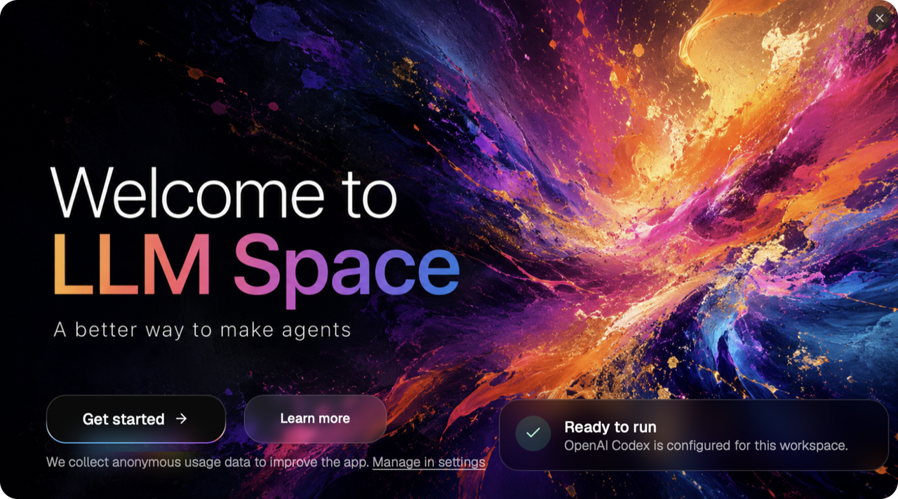
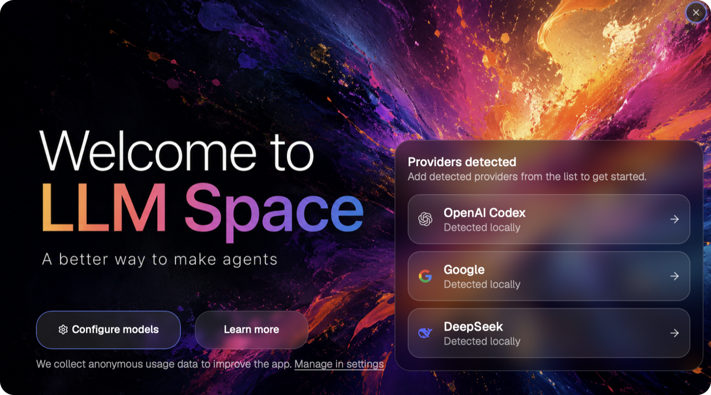
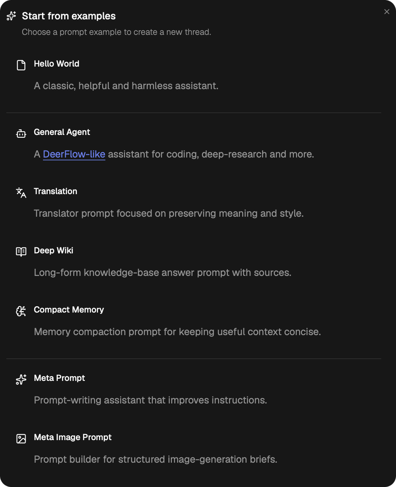
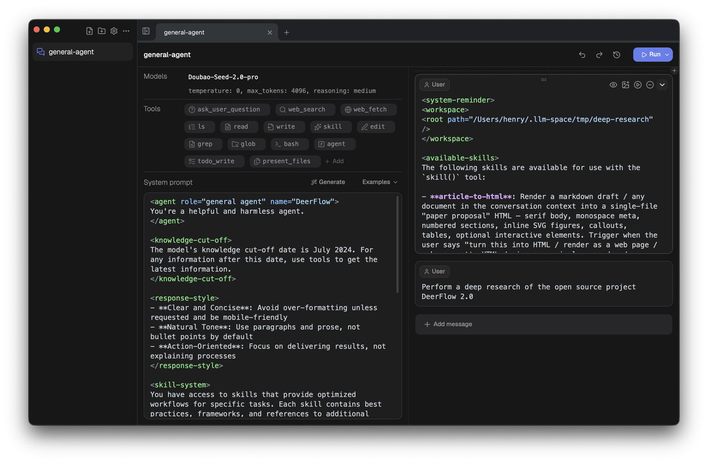
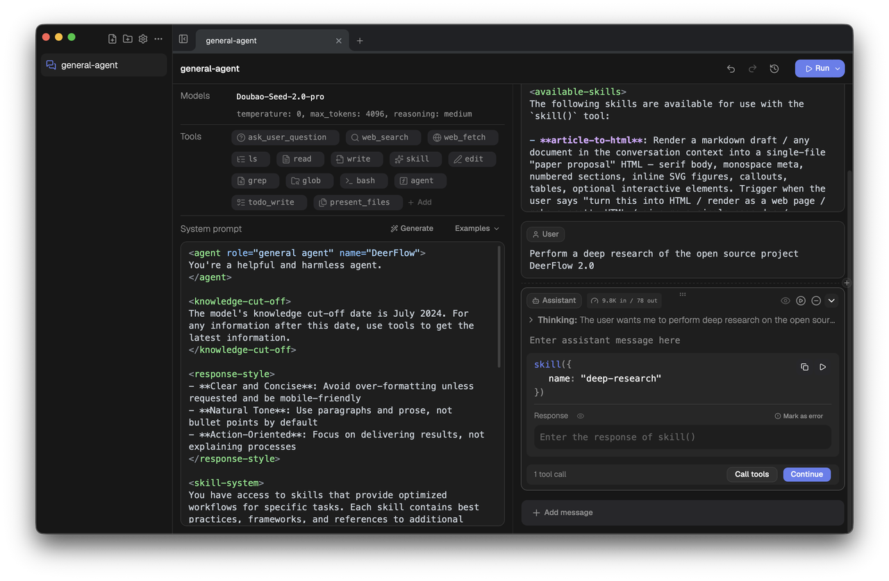
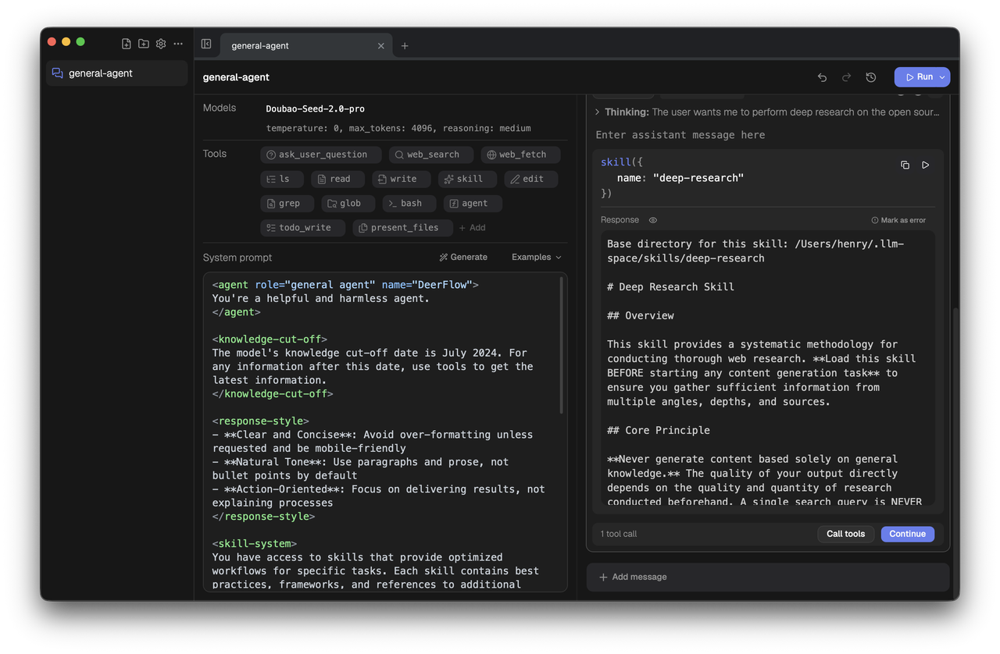
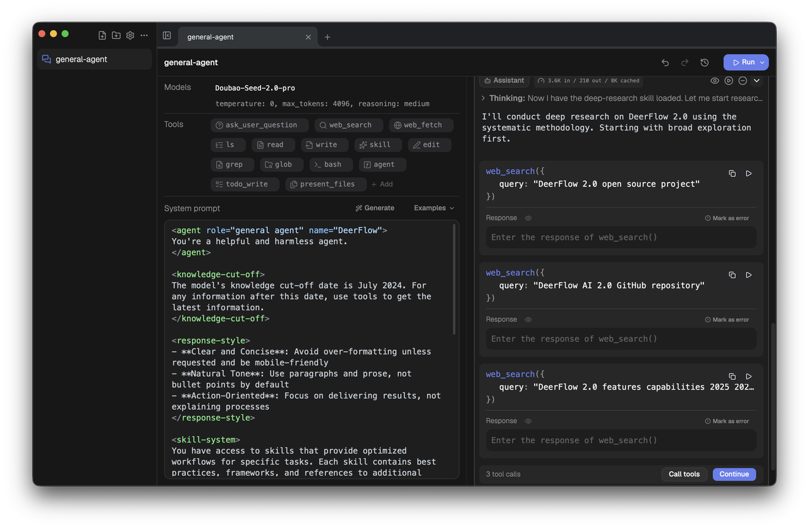
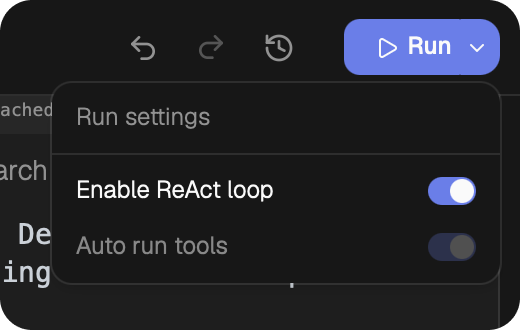
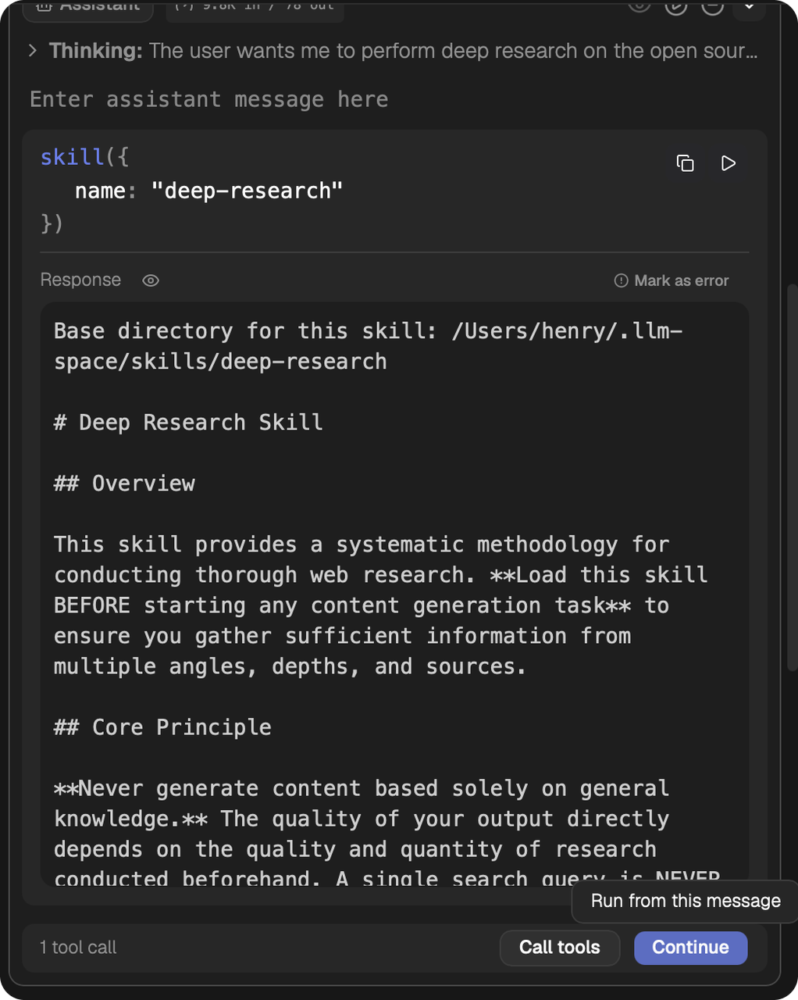

# LLM Space 4 Quick Start

Welcome to LLM Space 4.

LLM Space started in March 2023 and has now completed its third major upgrade. It is a desktop development tool designed for Agent developers, product managers, and test engineers. You can use it to experiment with new Agent ideas, observe runs, debug behavior, and evaluate Agent performance.

LLM Space is open source. If it helps you, please support the project with a Star on the [GitHub repository](https://github.com/deer-flow/llm-space).



# Common Documents and Links

- [GitHub repository](https://github.com/deer-flow/llm-space): a Star is the best support for the project.
- [Support and donate](https://my.feishu.cn/wiki/OvLBwVuSkiCR1ik5wGEcBXZfnye): support the project if you like it.
- [Harness course series](https://my.feishu.cn/wiki/L082wubkdie8uMkRUjgceKYQnIe): learn systematic methods for Agent development, debugging, and evaluation.

# Download, Install, and Update

Download the installer for your operating system from the project release channel, then install it like a normal desktop application. Future updates can be installed over the existing app. If you need to keep your current configuration and Threads, do not delete the local LLM Space data directory.

By default, LLM Space stores user data in:

```text
~/.llm-space
```

`workspace/` stores Thread files, and `settings/` stores model, MCP, window, and other settings. For more details about storage format, see [Core Concepts](./core-concepts.md).

# Configure Models Quickly

When you open LLM Space for the first time, you will see the onboarding screen. LLM Space reads possible API Key values from your current environment variables and recommends available Model Providers.



If the `Providers detected` list appears on the right, click any provider to add it quickly. After a provider is added successfully, the welcome page shows `Ready to run`, which means at least one model is available for the current workspace.


If no detected provider appears, click `Configure models` to open the Model settings dialog. There you can manually add Providers, API Keys, Base URLs, and model lists. You can also open Settings later to add or modify more model providers. See [Settings](./settings.md) for details.

After configuring a model, click `Get started` to enter the main interface.

# Run Your First Thread

A Thread is the complete context for an Agent. It contains the model, model parameters, tools, system prompt, and message list. It is a saveable, copyable, debuggable conversation experiment.

Common Thread contents include:

| Content | Description |
| --- | --- |
| Models | The model and Provider used by the current Thread. |
| Model parameters | Runtime parameters such as `temperature`, `max_tokens`, and `reasoning_effort`. |
| Tools | Tools the Agent can call, such as built-in tools, Custom Function Tools, and MCP tools. |
| System Prompt | Global behavior instructions for the Agent. |
| Message List | User / Assistant messages, plus Tool Calls initiated by Assistant messages. |

For a more complete terminology guide, see [Core Concepts](./core-concepts.md).

## Create a Thread from an Example

In the main interface, click `Start from Example` and choose an example to create a new Thread.



Choose `General Agent` as your first Thread. It includes a set of common tools and a system prompt, which makes it a good starting point for trying the Agent debugging workflow.



## Run the Thread

Click the `Run` button in the top-right corner to run the current Thread.



After the run starts, an Assistant message appears on the right. In the screenshot above, the Assistant message contains a call to the `skill()` tool. Because `skill()` is a built-in LLM Space tool, you can click the play button on the tool card, or click `Call tools` at the bottom, to execute the tool and get a response.



After the tool returns a result, click `Continue` to move to the next turn, which continues the ReAct Loop.

## Debug Multiple Tool Calls

As the run continues, you may see an Assistant Message that contains multiple tool calls.



There are two ways to debug this kind of message:

- Click `Call tools` to run all pending Tool Calls in parallel.
- Click the play button on an individual tool call card to run only that Tool Call.

This helps you inspect why the model chose a tool, what arguments it passed, and how the tool result affects later reasoning.

## Enable ReAct Loop

Besides step-by-step debugging, you can let LLM Space continue the ReAct Loop automatically.

Click the dropdown beside the `Run` button in the top-right corner, open run settings, and enable `Enable ReAct loop`.



After enabling it, find the User Message or Assistant Message you want to use as the starting point, then click `Continue` or `Run from this message`. LLM Space will automatically continue subsequent ReAct Loop steps until the run finishes or reaches a step that needs manual handling.



# Continue Debugging Your Agent

The core value of LLM Space is not just "getting one conversation to run". It lets you directly edit the Agent's runtime state:

- Change the model and model parameters to compare behavior across models.
- Change Tools to observe how the tool list affects model decisions.
- Change the System Prompt to iterate Agent behavior quickly.
- Change User Messages and Assistant Messages to reproduce experiment conditions.
- Change Tool Call arguments or responses to validate errors, edge cases, and different tool outputs.
- Compare run history with reusable evaluation rubrics, per-criterion scores, and an explicit score delta to decide which version is better.

This is Agent debugging in LLM Space: turn an Agent run into observable, editable, replayable context.


---


After finishing this quick start, continue with:

- [Core Concepts](./core-concepts.md)
- [Variables and Templates](./variables-and-templates.md)
- [UI Layout](./ui-layout.md)
- [Settings](./settings.md)
- [Shortcut Keys](./shortcut-keys.md)
