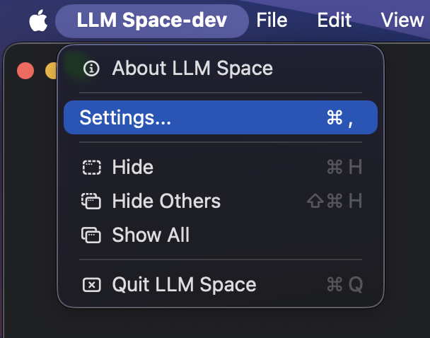
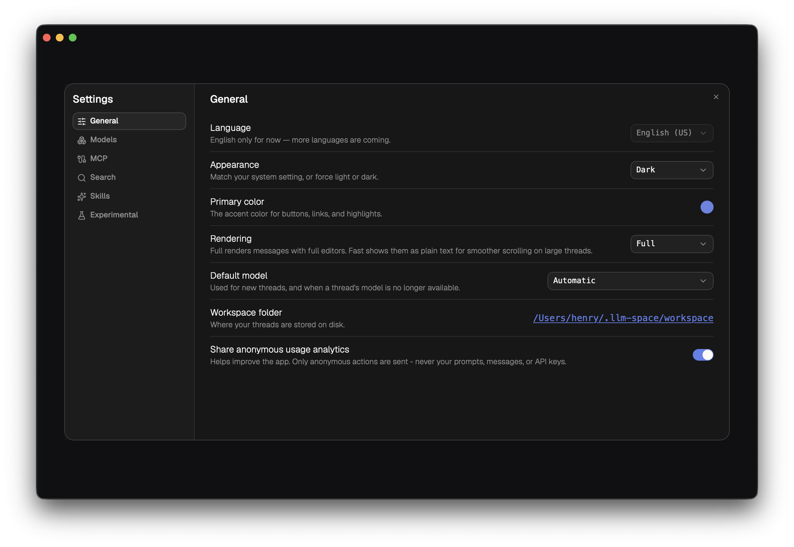
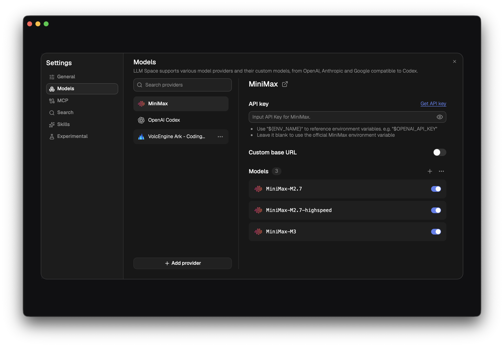
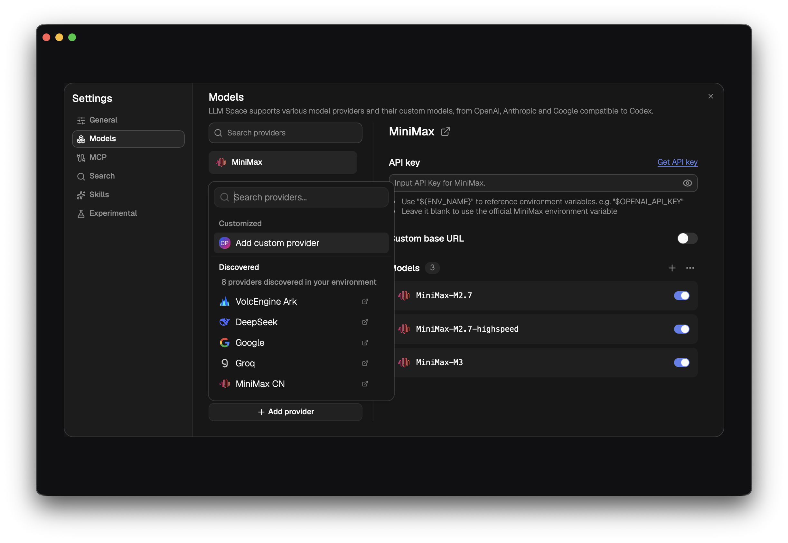
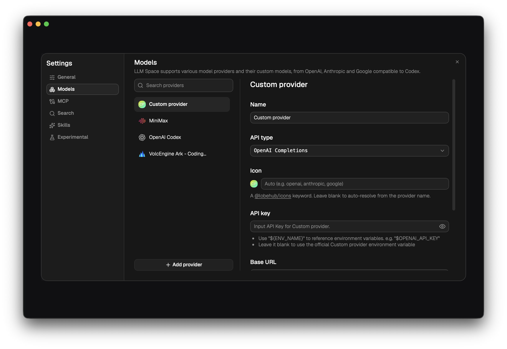
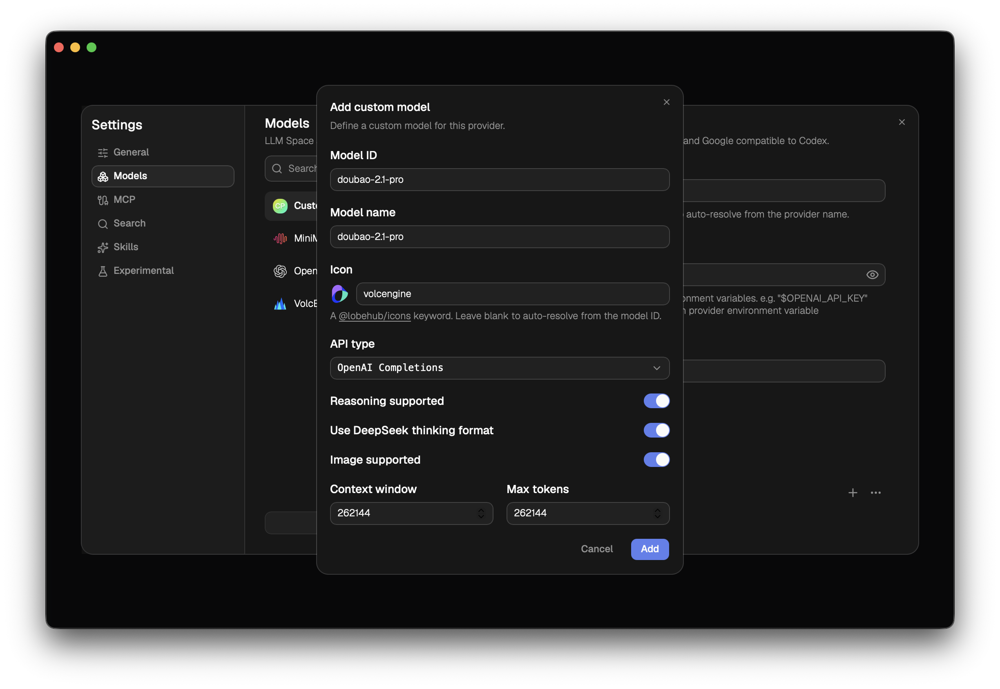
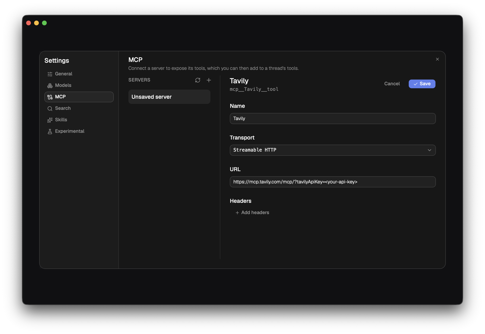
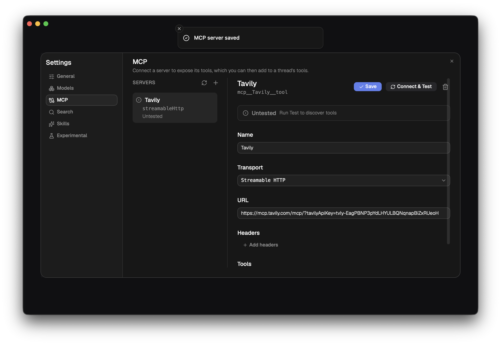
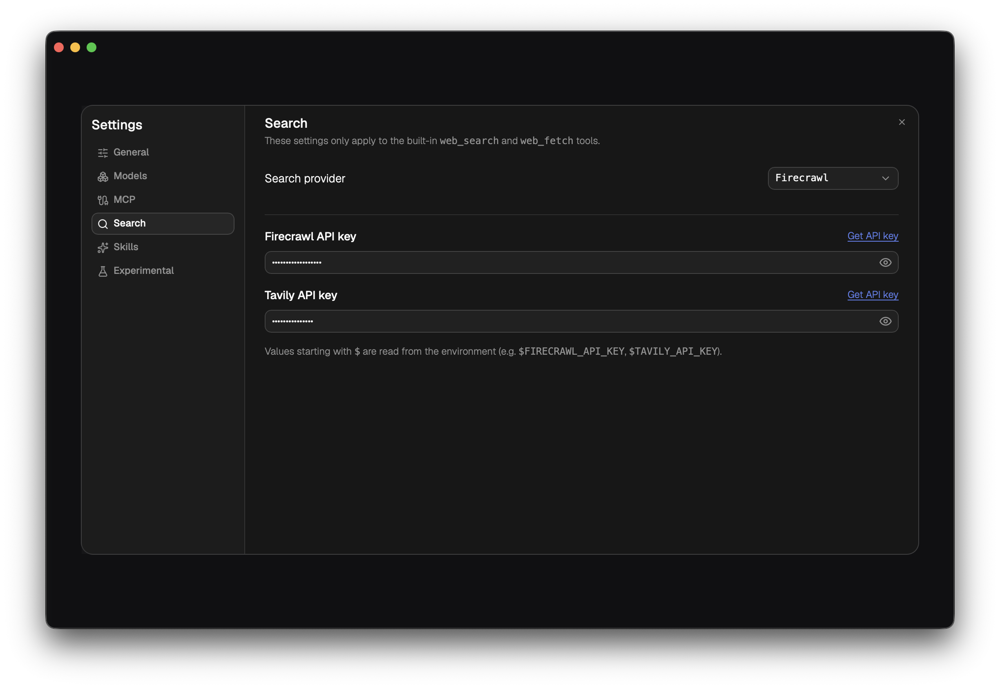
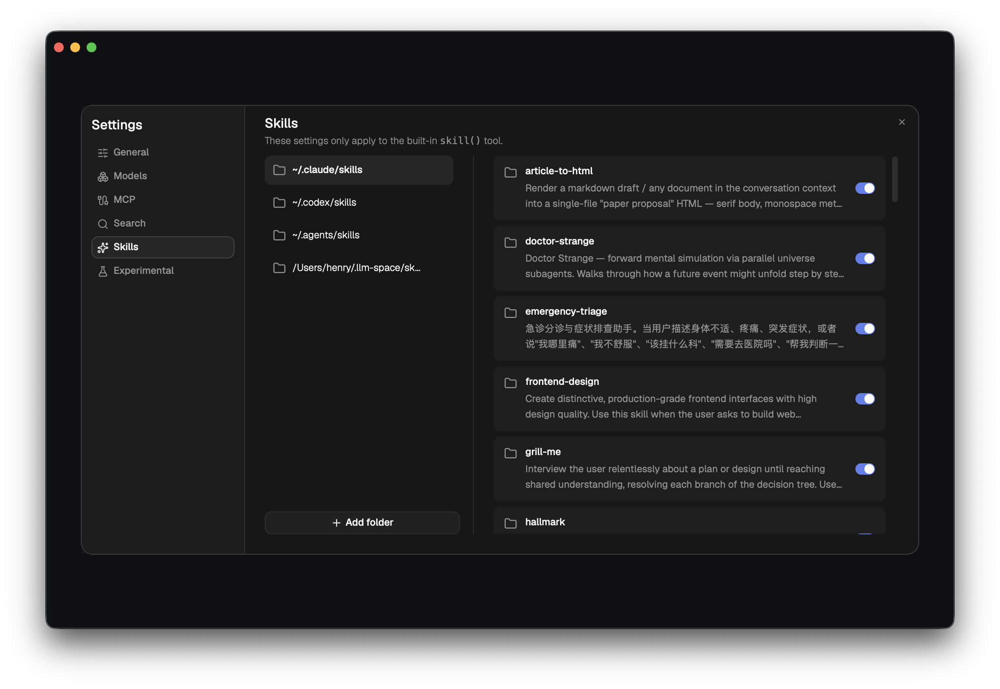

# 设置

Settings 是 LLM Space 的全局配置中心。这里管理应用外观、默认模型、模型提供商、MCP Server、内置搜索工具和 Skill 发现目录。



# 如何进入设置页面

在 macOS 顶部菜单栏中，单击 `LLM Space` 或开发版本中的 `LLM Space-dev`，然后选择 `Settings...`。

也可以使用快捷键：

```text
Command + ,
```

Settings 打开后，左侧是设置分类，右侧是当前分类的配置表单。当前文档介绍以下页面：

| 页面 | 用途 |
| --- | --- |
| General | 配置语言、外观、默认模型、工作区目录和匿名数据分析开关。 |
| Models | 添加和管理 Model Provider，以及启用、禁用、添加自定义模型。 |
| MCP | 添加和测试 MCP Server，让 Thread 可以使用外部 MCP 工具。 |
| Search | 配置内置 `web_search` 和 `web_fetch` 工具使用的搜索服务。 |
| Skills | 配置内置 `skill()` 工具可以发现的 Skill 目录。 |

# General

General 页面用于配置应用级别的默认行为。



| 设置项 | 说明 |
| --- | --- |
| Language | 语言设置。目前仅支持 English (US)，后续会增加更多语言。 |
| Appearance | 应用主题。可以选择跟随系统、强制浅色或强制深色。 |
| Primary color | 主色，用于按钮、链接和高亮状态。 |
| Rendering | 消息渲染模式。`Full` 使用完整编辑器渲染消息；`Fast` 以纯文本方式显示，适合大型 Thread 中更流畅地滚动。 |
| Default model | 新建 Thread 默认使用的模型。当某个 Thread 保存的模型不可用时，也会回退到这里选择的默认模型。 |
| Workspace folder | 当前工作区目录，Thread 文件保存在这里。单击路径可以在系统文件管理器中打开。 |
| Share anonymous usage analytics | 是否分享匿名使用数据。匿名数据只包含产品行为，不包含 prompt、messages 或 API keys。 |

## Default model

`Default model` 可以选择一个已启用的模型，也可以保持 `Automatic`。

- 选择具体模型：新建 Thread 会默认使用这个模型。
- 选择 `Automatic`：LLM Space 会从当前可用模型中自动选择一个。

如果你发现新建 Thread 总是使用了不想要的模型，可以先检查这里的默认模型设置。

## Workspace folder

`Workspace folder` 显示 Thread 文件保存位置。默认情况下，它位于：

```text
~/.llm-space/workspace
```

这里的每个 `.json` 文件都对应一个 Thread。更多 Thread 文件格式见 [核心概念](./core-concepts.zh-CN.md)。

# Models

Models 页面用于管理模型提供商和模型列表。Thread 运行时选择的模型，都来自这里已经配置并启用的 Model Provider。



## 添加 Provider

单击左下角 `Add provider` 可以添加模型提供商。



Provider 菜单通常分为几类：

| 分组 | 说明 |
| --- | --- |
| Customized | 添加自定义 Provider。适合兼容 OpenAI、Anthropic 或 Responses API 的第三方服务。 |
| Discovered | LLM Space 从本机环境变量中检测到 API Key 的 Provider。 |
| Recommended | 推荐的常用内置 Provider。 |
| Built-in | 其他内置 Provider。 |

添加内置 Provider 后，右侧会显示 API Key、Base URL 和模型列表等配置。

## 配置内置 Provider

Models 页面右侧显示当前选中 Provider 的配置。内置 Provider 通常包含以下配置：

| 配置项 | 说明 |
| --- | --- |
| API key | Provider 的 API Key。可以直接填写，也可以引用环境变量。 |
| Custom base URL | 是否使用自定义 API 地址。关闭时使用 Provider 默认地址。 |
| Models | Provider 下的模型列表。可以单独启用或禁用模型。 |

API Key 支持环境变量引用。例如：

```text
"$OPENAI_API_KEY"
```

如果 API Key 留空，LLM Space 会尝试使用该 Provider 官方约定的环境变量。

## 添加自定义 Provider

如果你的模型服务兼容 OpenAI、Anthropic 或 OpenAI Responses API，可以添加自定义 Provider。



自定义 Provider 常见配置包括：

| 配置项 | 说明 |
| --- | --- |
| Name | Provider 显示名称。 |
| API type | API 兼容类型，例如 OpenAI Completions、Anthropic Messages、OpenAI Responses。 |
| Icon | Provider 图标关键词。可以留空，让 LLM Space 按名称自动匹配。 |
| API key | 调用该 Provider 所需的 API Key。 |
| Base URL | API 服务地址。自定义 Provider 必须配置。 |
| Headers | 额外 HTTP Header。适合需要特殊认证或网关参数的服务。 |

## 添加自定义模型

在 Provider 的 `Models` 区域，单击添加按钮可以添加自定义模型。



自定义模型常见字段包括：

| 字段 | 说明 |
| --- | --- |
| Model ID | Provider API 中实际使用的模型 ID。 |
| Model name | 在 LLM Space 中显示的模型名称。 |
| Icon | 模型图标关键词。 |
| API type | 该模型使用的 API 兼容类型。 |
| Reasoning supported | 模型是否支持 reasoning 参数或推理能力。 |
| Use DeepSeek thinking format | 是否使用 DeepSeek 风格的 thinking 格式。 |
| Image supported | 模型是否支持图片输入。 |
| Context window | 上下文窗口大小。 |
| Max tokens | 最大输出 token 数。 |

配置完成后，这个模型会出现在 Thread 的模型选择器中。

## 启用、禁用和移除

Models 页面还可以做这些操作：

- 在模型列表中单独启用或禁用某个模型。
- 通过模型列表右上角菜单批量启用或禁用模型。
- 通过 Provider 列表项右侧菜单移除 Provider。
- 编辑自定义模型，或删除不再需要的自定义模型。

移除 Provider 不会删除已有 Thread 文件，但如果 Thread 引用了已移除的模型，运行时会回退到可用模型或默认模型。

# MCP

MCP 页面用于连接 MCP Server。连接后，Server 暴露的工具可以添加到 Thread 的 Tools 中，让模型通过 MCP 调用外部能力。

## 添加 MCP Server

单击 `Servers` 列表右上角的 `+`，创建一个新的 MCP Server。



MCP Server 需要配置：

| 配置项 | 说明 |
| --- | --- |
| Name | Server 显示名称。LLM Space 会根据名称生成工具前缀。 |
| Transport | 连接方式，支持 `stdio`、`Streamable HTTP` 和 `SSE`。 |
| Command | `stdio` 模式下启动 MCP Server 的命令。 |
| Args | `stdio` 模式下传给命令的参数，每行一个参数。 |
| Working directory | `stdio` 模式下的工作目录。 |
| Environment | `stdio` 模式下传给进程的环境变量。 |
| URL | `Streamable HTTP` 或 `SSE` 模式下的远程 MCP 地址。 |
| Headers | 远程 MCP 请求附加的 HTTP Header。 |

配置完成后，单击 `Save` 保存。

## 测试 MCP Server

保存后，单击 `Connect & Test`。LLM Space 会连接 MCP Server，并尝试列出它暴露的工具。



测试结果会显示在 Server 详情上方：

| 状态 | 含义 |
| --- | --- |
| Untested | 已保存，但还没有测试连接。 |
| Connected | 连接成功，并成功读取工具列表。 |
| Failed | 连接或协议握手失败，需要检查配置。 |

测试成功后，可以在 Thread 的 Tools 区域添加这些 MCP 工具。MCP 工具名称通常会带有 Server 前缀，例如：

```text
mcp__tavily__search
```

# Search

Search 页面用于配置内置 `web_search` 和 `web_fetch` 工具的搜索服务。

**注意：Search 设置只对内置 `web_search` 和 `web_fetch` 工具生效。** 它不会影响模型 Provider、MCP 工具，也不会改变普通 Thread 的模型调用行为。



当前支持的 Search Provider：

| Provider | 说明 |
| --- | --- |
| Firecrawl | 默认搜索 Provider。需要配置 Firecrawl API Key。 |
| Tavily | 可选搜索 Provider。需要配置 Tavily API Key。 |

页面中的 API Key 支持两种写法：

```text
直接填写 API Key
```

或引用环境变量：

```text
$FIRECRAWL_API_KEY
$TAVILY_API_KEY
```

如果你的 Thread 没有启用 `web_search` 或 `web_fetch` 工具，这里的 Provider 和 API Key 设置不会参与运行。

# Skills

Skills 页面用于配置内置 `skill()` 工具的发现目录。Thread 中启用 `skill()` 工具后，模型可以请求加载这些目录中的 Skill。

**注意：Skills 设置只对内置 `skill()` 工具生效。** 它不会影响 MCP 工具、自定义 Function Tool，也不会自动把 Skill 当作普通工具加入 Thread。



## Skill 发现目录

左侧是 Skill 发现目录列表。LLM Space 会扫描这些目录下的 Skill，并在右侧显示每个 Skill 的名称、描述和开关状态。

默认会包含常见目录，例如：

```text
~/.claude/skills
~/.codex/skills
~/.agents/skills
```

也可能包含 LLM Space 自己管理的 Skill 目录。

## 添加和移除目录

单击 `Add folder` 可以添加新的 Skill 目录。

目录需要满足 Skill 结构约定：每个 Skill 是目录下的一个子目录，并包含 `SKILL.md`。

示例：

```text
my-skills/
  deep-research/
    SKILL.md
  writing-assistant/
    SKILL.md
```

可以通过目录项右侧菜单移除目录。移除目录只会从 LLM Space 的发现列表中删除它，不会删除磁盘上的真实文件。

## 启用和禁用 Skill

右侧列表中的每个 Skill 都有独立开关：

- 开启：`skill()` 工具可以发现并使用这个 Skill。
- 关闭：该 Skill 会被隐藏，不会提供给 `skill()` 工具。

目录项右侧菜单还可以批量 `Enable all skills` 或 `Disable all skills`。

# 设置保存位置

Settings 中的大多数配置会保存到本机数据目录：

```text
~/.llm-space/settings
```

常见文件包括：

| 文件 | 内容 |
| --- | --- |
| `models.json` | Model Provider、API Key 引用、Base URL、自定义模型和模型启用状态。 |
| `mcp.json` | MCP Server 配置。 |
| `search.json` | Search Provider 和搜索 API Key 配置。 |
| `skills.json` | Skill 发现目录和隐藏状态。 |
| `analytics.json` | 匿名数据分析开关和匿名安装 ID。 |
| `window.json` | 桌面窗口位置、大小、缩放等状态。 |

如果设置出现异常，可以先备份整个 `~/.llm-space` 目录，再检查对应 JSON 文件。
