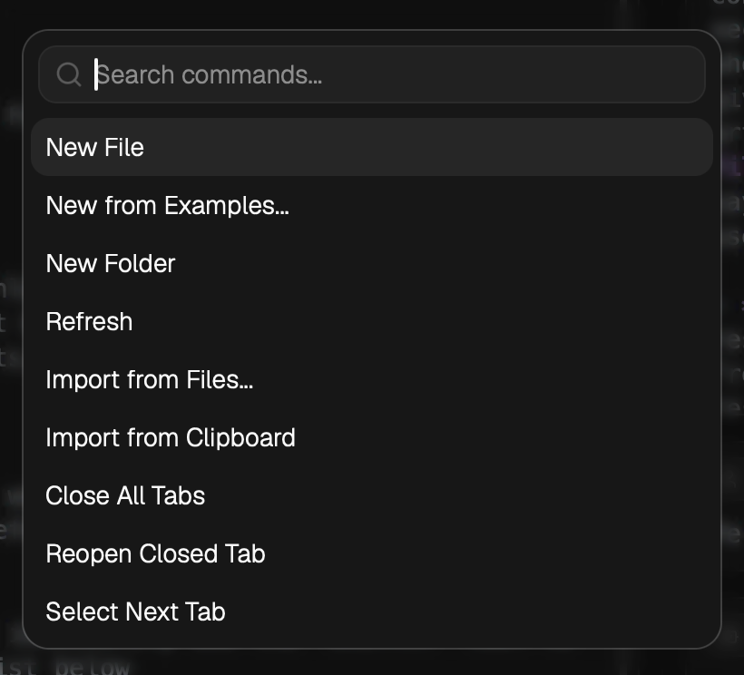

# Shortcut Keys

LLM Space supports shortcuts from both the desktop menu and the Thread editor. This document uses the macOS `Command` key in examples; on Windows / Linux, the equivalent key is usually `Ctrl`.

# Menu Shortcuts

These shortcuts come from the desktop application menu.

| Menu | Action | macOS shortcut | Windows / Linux |
| --- | --- | --- | --- |
| LLM Space | Open Settings | `Command + ,` | `Ctrl + ,` |
| LLM Space | Hide app | `Command + H` | `Ctrl + H` |
| LLM Space | Hide other apps | `Command + Shift + H` | `Ctrl + Shift + H` |
| LLM Space | Quit app | `Command + Q` | `Ctrl + Q` |
| File | New Thread file | `Command + N` | `Ctrl + N` |
| File | New folder | `Command + Shift + N` | `Ctrl + Shift + N` |
| File | Close current tab | `Command + W` | `Ctrl + W` |
| File | Reopen closed tab | `Command + Shift + T` | `Ctrl + Shift + T` |
| View | Open Command Palette | `Command + Shift + P` | `Ctrl + Shift + P` |
| View | Toggle left Sidebar | `Command + B` | `Ctrl + B` |
| View | Reload app | `Command + Shift + R` | `Ctrl + Shift + R` |
| View | Zoom in | `Command + +` | `Ctrl + +` |
| View | Zoom out | `Command + -` | `Ctrl + -` |
| View | Reset zoom | `Command + 0` | `Ctrl + 0` |
| Window | Select previous tab | `Command + Option + Left` | `Ctrl + Alt + Left` |
| Window | Select next tab | `Command + Option + Right` | `Ctrl + Alt + Right` |
| Window | Toggle fullscreen | `Command + Shift + F` | `Ctrl + Shift + F` |

# Command Palette

`Command + Shift + P` opens the Command Palette. You can search for and run app commands there, such as opening Settings, toggling the Sidebar, importing files, or closing tabs.

# Thread Run Shortcuts

The Thread page supports quickly running the current Thread or continuing from a specific message.

| Action | macOS shortcut | Windows / Linux | Behavior |
| --- | --- | --- | --- |
| Run / stop current Thread | `Command + Enter` | `Ctrl + Enter` | If no Message editor is focused, run from the last message. If a run is already in progress, stop the current run. |
| Run from current Message | `Command + Enter` | `Ctrl + Enter` | If a Message editor is focused, run from that message. |
| Run from current Message | `Command + R` | `Ctrl + R` | If a Message editor is focused, run from that message. If no Message is focused, run from the last message. |
| Open quick command entry | `Command + P` | `Ctrl + P` | Used to quickly trigger common actions. |

`Command + P` opens a command search entry where you can type to find actions such as creating files, importing content, closing tabs, or switching tabs.

## When a Message is focused

When the cursor is inside a User Message or Assistant Message editor, the run shortcut uses that Message as the starting point. This is equivalent to using `Run from this message` / `Continue` on that message.

This is useful for debugging intermediate steps: edit a User Message, Assistant Message, or Tool Call result, then continue running from that point.

## When no Message is focused

When focus is not inside any Message editor, the run shortcut starts from the last message. This is equivalent to clicking `Run` in the top-right corner of the Thread.

If the current Thread is already running, triggering the run shortcut again stops the current run.

# Editor Shortcuts

Some inputs and editors handle their own shortcuts first. For example, cut, copy, paste, undo, and redo follow the operating system's default behavior in text editing areas.

If a shortcut does not trigger a global action, first check whether focus is inside an input, CodeMirror editor, or dialog form.
