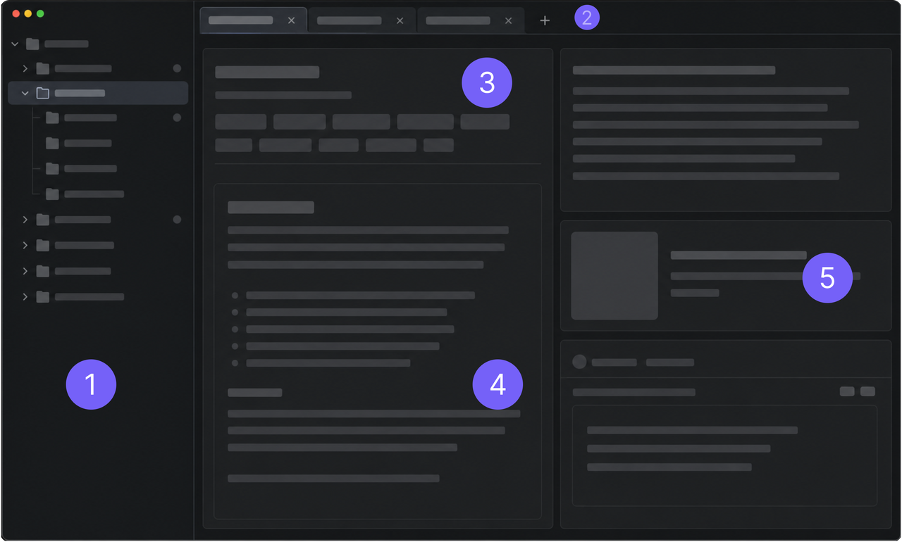

# UI Layout

The LLM Space main interface is organized around editing, running, and debugging Threads. The left side manages workspace files, the middle area contains the active Thread editor, and the right side shows run output, previews, and debugging context.

| Number | Area | Description |
| --- | --- | --- |
| 1 | Workspace | The workspace file tree. It shows directories and Thread JSON files under `workspace/`, and is used to create, open, copy, move, delete, and organize Threads. |
| 2 | Thread Tabs | Open Thread tabs. Use these tabs to switch between multiple Threads, or open more experiments in new tabs. |
| 3 | Thread Settings | Runtime settings for the current Thread. This area usually includes the title, model selection, run parameters, Tools, and related experiment settings. |
| 4 | System Prompt | Edit the System Prompt here to adjust model behavior and output. |
| 5 | Messages | The conversation editing and run area. It shows User / Assistant messages, model output, tool call records, and streaming responses during a run. |

The core idea is simple: choose files on the left, edit and run the Thread in the middle, and inspect evidence and debugging context on the right.
